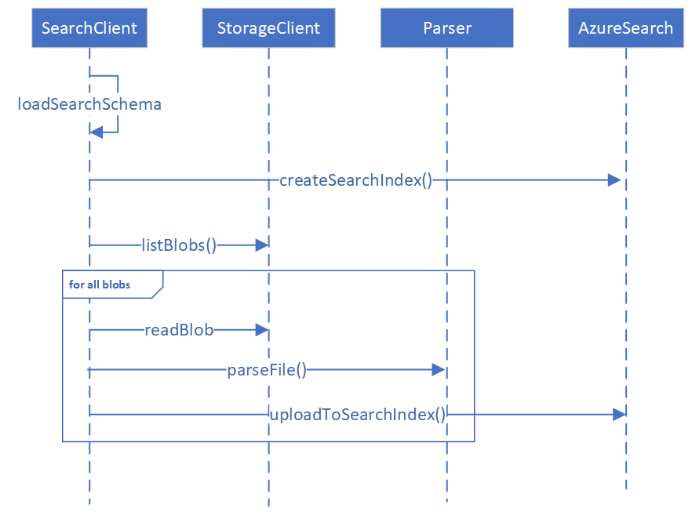
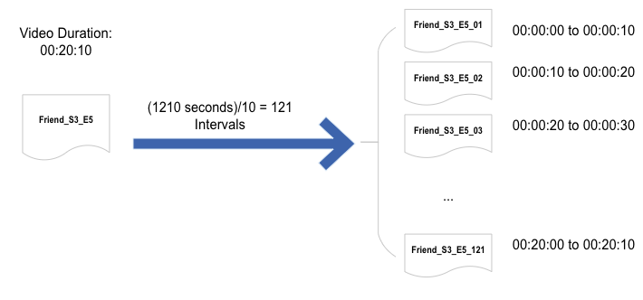
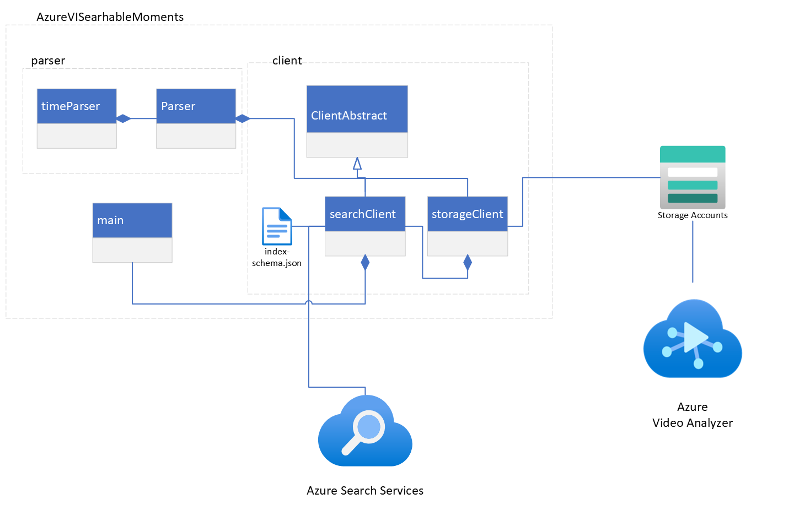

# Architecture deep-dive
In this page you can find the architecture of the Azure Video Indexer Searchable moments.
We assume that you have already processed the video files using [Azure video Analyzer](https://azure.microsoft.com/en-us/products/video-analyzer/) and upload the output files into a container in a storage account.
Here is the system sequence diagram of the Azure Video Indexer Searchable moments.

## Create Search Index:

We should have a search index that supports all video indexer features. Depending on our use case, we may need to add additional fields to our search index to accommodate those custom features not provided by the Azure Video Indexer.
We will be using [index-schema.json](src/client/index-schema.json) file to create a search index.

## Parse Video Indexer Output to Moments:

Video Indexer process shows and generates one JOSN file per video. First, we need to store those json files into a container in our azure storage account.

Then we need to parse these JSON files into n intervals (e.g., n=10 seconds interval). For instance, if a video duration is 00:20:10, using 10 seconds intervals, we will have 121 documents (each covering 10 seconds of the show). 

Here is the overall architecture of Azure Video Indexer Searchable moments

