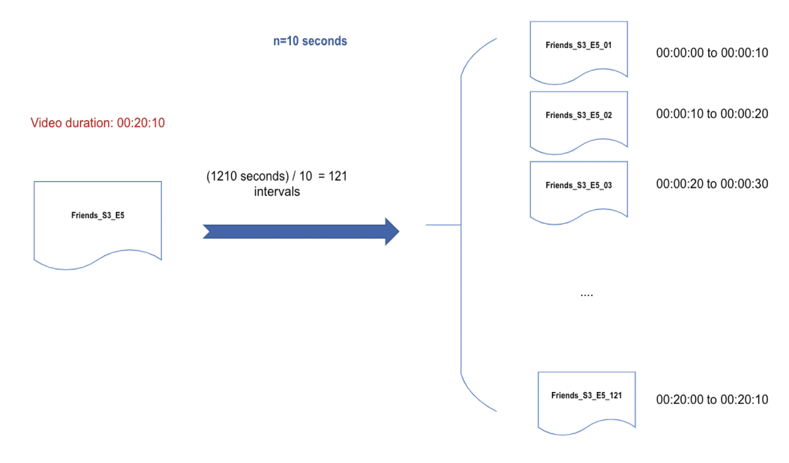

## Transfer Azure Video indexer output to Searchable Content


#### Overview
This project reads [Azure Video indexer](https://azure.microsoft.com/en-in/services/media-services/video-indexer/) output file (JSON format) into small  chunks of searchable content.

So you can make the following queries to the azure search index to find the right moments of a video:

- _"Find the moments where '**Jennifer Aniston**' in Friends TV show is happy"_ 

```json
{
  "search": "Jennifer Aniston",
  "searchFields": "faces/face, name",
  "filter": "search.ismatchscoring('friends')and (emotions/any(em: em/emotion eq 'Joy')) "
}
```

- _"Find the moments in any show where the transcript is '**getting old**'"_
```json
{
  "search": "getting old",
  "searchFields": "transcripts/transcript"
}
```
- _"Find the moments in Friends show where '**Jean Claude**' Appears_"
```json
{  
  "search": "Jean Claude",
  "searchFields": "faces/face, namedPeople/namedPerson",
  "filter": "search.ismatchscoring('friends') ",
}
```

#### Architecture:
Below is the architecture of the system we are using.
1. Azure video indexer generates the JSON files and store them in the blob storage.
1. AzureViSearchableContent module reads the files from theblob storage and after  parsing them, it uploads the records into the search index.

 

So you can search you video by keywords, labels, sentiments, actors etc. and the result will be the HH:MM:SS where your search occurs.

For instance if a video duration is **00:20:10** , using **10** seconds intervals, we will have **121** documents (each covering 10 seconds of the show).

 


#### Client and Parser Usage

**1. Read data from the blob:**

To read  the JSON files from the blob:

- Make sure the [config.yml](config/config.yml) has required  values to connect to the storage account.
- Run the [storage-client.py](client/storage-client.py) script

This will read the data from a container into your local machine


**2. Create/Upload data into Azure Search:**
Now that you have the data in your local machine, you can create a search index and after parsing those data, upload them into the search index

Run [search-client.py](client/search-client.py) which performs teh followings:

- Creates a search index (using [index-schema.json](client/index-schema.json) file) 
- Reads JSON files from [files/blob-files](client/files/blob-files)
- Using Parser class parses each json file and creates list of created intervals
- Upload the data into azure search index 

**Note 1:** Every successful upload will be added to  [files/processed/ingested.txt](client/files/processed/ingested.txt) 

**Note 2:** Every unsuccessful upload will be added to [files/processed/failed-to-ingest.txt](client/files/processed/failed-to-ingest.txt)