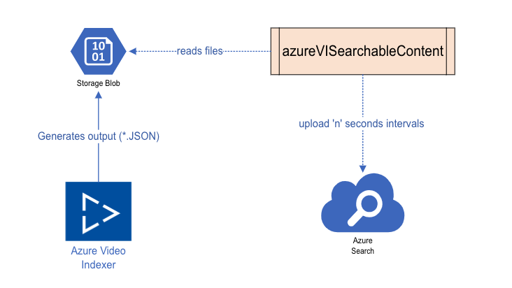
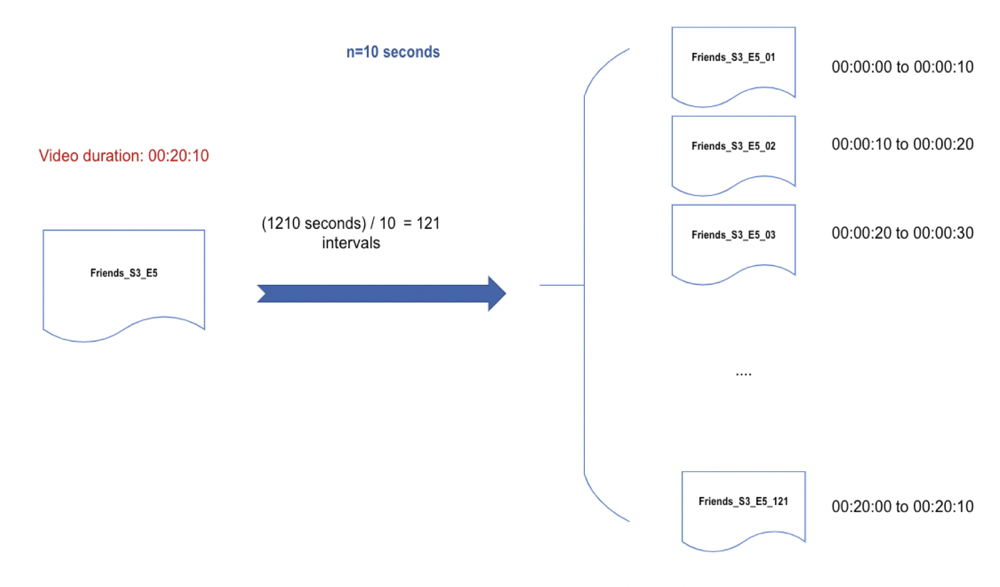

# Transfer Azure Video indexer output to Searchable Content


## Overview
This project reads [Azure Video Indexer](https://azure.microsoft.com/en-in/services/media-services/video-indexer/) output file (JSON format) into small  chunks of searchable content.

So you can make the following queries to the azure search index to find the right moments of a video:

- _"Find the moments where '**Jennifer Aniston**' in Friends TV show is happy"_ 

```json
{
  "search": "Jennifer Aniston",
  "searchFields": "faces/face, name",
  "filter": "search.ismatchscoring('friends')and (emotions/any(em: em/emotion eq 'Joy')) "
}
```

- _"Find the moments in any show where the transcript is '**getting old**'"_
```json
{
  "search": "getting old",
  "searchFields": "transcripts/transcript"
}
```
- _"Find the moments in Friends show where '**Jean Claude**' Appears_"
```json
{  
  "search": "Jean Claude",
  "searchFields": "faces/face, namedPeople/namedPerson",
  "filter": "search.ismatchscoring('friends') ",
}
```
- _"Find the moments in The Hobbit where weather condition is '**sandstorm**' or '**rain**'_"

```json
{
  "search": "*",
  "filter": "search.ismatchscoring('The Hobbit') and 
             weatherConditions/any(c: c/condition eq 'sandstorm' or c/condition eq 'rain')"
}
```

## Set up and run the project

The project can be run like any other Python code, or packaged into a Docker image and run
accordingly.

Below we detail both approaches.

### General set up

For both local development and running the code without Docker, you'll need to do the following.

**Create a virtual environment**

On Mac and linux:
`python3 -m venv env`

On Windows:
`py -m venv env`

**Activate your virtual environment**

On macOS and Linux:
`source env/bin/activate`

On Windows:

`.\env\Scripts\activate`

**Add required libraries**

`pip install -r requirements.txt`

### Run the project

#### Standard - From YAML config

Copy the contents of [`config-dev.yml`](src/config/config-dev.yml) to a new gitignored file 
`config.yml`, and add the required details. NOTE: These include secrets and so should never be
pushed to version control.

```yaml
# this is used when you want to parse files from storage account
storage:
  connection-string: "YOUR STORAGE ACCOUNT CONNECTION STRING"
  # a container which you store JSON files processed by Azure Video Indexer
  container: "YOUR CONTAINER NAME"

search:
  service-name: "SEARCH SERVICE NAME"
  api-version: "SEARCH SERVICE API VERSION"
  api-key: "SEARCH SERVICE API KEY"
  index-name:  "NAME OF THE SEARCH INDEX YOU WANT TO CREATE"
  index-schema-path: "PATH TO SEARCH INDEX SCHEMA e.g. client/index-schema.json"

files:
  vi-output-directory: "PATH TO VI JSON FILES e.g. client/files/vi-files"
  processed-directory: "PATH TO PROCESSED FILE DIRECTORY e.g. client/files/processed"
  ingested-file: "NAME OF THE LOGS FOR PROCESSED ASSETS e.g. ingested.txt"
  failed-to-ingest-file: "NAME OF THE LOGS FOR FAIL PROCESSED ASSETS e.g. failed-to-ingest.txt"

# interval durations you wish to create in milliseconds
parser:
  milliseconds-interval: 10000
```

Navigate into the `src` directory with `cd src`. 

Now using command line you can run the scripts in two ways:

1. Process insights files from your specified storage account and container: `python main.py`
2. Process insights files from the local filesystem: `python main.py local`


#### Alternative - Using Docker

When using Docker, we build and run a Python image, passing in the config details as environment
variables, and have the option of mounting our index schema and any other files needed from the 
host (local machine).

First [ensure you have Docker installed and working](https://docs.docker.com/get-docker/).

As your `config.yml` will not be configurable once an image is built, remove it if created, or just 
leave the repo in its original state. With only `config-dev.yml`, the code will rely upon relevant
environment variables passed in at runtime to determine how it should run.

From the root of the repository, build the docker image using:

```bash
docker -t azure-vi-searchable-content .
```

See the [`Dockerfile`](Dockerfile) for details on how the image is constructed.

To run the image successfully, we need to pass in environment variables as follows:

```bash
docker run \
-e INSIGHTS_CONTAINER_NAME="YOUR INSIGHTS CONTAINER NAME" \                                                                                                                                                                                                   ✹
-e SEARCH_SERVICE_NAME="YOUR SEARCH SERVICE NAME" \
-e SEARCH_API_VERSION="2020-06-30" \
-e SEARCH_API_KEY="YOUR SEARCH API KEY" \
-e SEARCH_INDEX_NAME="YOUR DESIRED SEARCH INDEX NAME" \
-e INDEX_SCHEMA_PATH="client/index-schema.json" \
-e VI_OUTPUT_DIRECTORY="client/files/vi-files" \
-e FILE_PROCESSING_LOGS_DIR="client/files/processed" \
-e INGEST_LOG_FILENAME="ingested.txt" \
-e INGEST_FAILURE_LOG_FILENAME="failed-to-ingest.txt" \
-e MILLISECONDS_INTERVAL=10000 \
-e STORAGE_CONNECTION_STRING="YOUR CONNECTION STRING" \
azure-vi-searchable-content:latest
```

Note that this will still retrieve your search index schema and write log files to inside the
container. This can be undesirable, so we can make all these configurable on the host machine by
volume mounting the `mount-files` directory, and managing the files there.

```bash
docker run \
-e INSIGHTS_CONTAINER_NAME="YOUR INSIGHTS CONTAINER NAME" \                                                                                                                                                                                                   ✹
-e SEARCH_SERVICE_NAME="YOUR SEARCH SERVICE NAME" \
-e SEARCH_API_VERSION="2020-06-30" \
-e SEARCH_API_KEY="YOUR SEARCH API KEY" \
-e SEARCH_INDEX_NAME="YOUR DESIRED SEARCH INDEX NAME" \
-e INDEX_SCHEMA_PATH="mount-files/index-schema.json" \
-e VI_OUTPUT_DIRECTORY="mount-files/logs" \
-e FILE_PROCESSING_LOGS_DIR="mount-files/logs" \
-e INGEST_LOG_FILENAME="ingested.txt" \
-e INGEST_FAILURE_LOG_FILENAME="failed-to-ingest.txt" \
-e MILLISECONDS_INTERVAL=10000 \
-e STORAGE_CONNECTION_STRING="YOUR CONNECTION STRING" \
-v "$(pwd)"/mount-files:/src/mount-files \
azure-vi-searchable-content:latest
```

When using the command above, changes to your index schema will be used in a newly running
container, without need to rebuild the image.

This can be simplified further using a gitignored .env file ([`.env-dev`](./.env-dev) is given as
an example), running the image as follows:

```bash
docker run \
--env-file "./.env" \
-v "$(pwd)"/mount-files:/src/mount-files \
azure-vi-searchable-content:latest
```

#### Architecture:
Below is the architecture of the system we are using.
1. Azure video indexer generates the JSON files and store them in the blob storage.
2. AzureViSearchableContent module reads the files from the blob storage and after parsing them, it uploads the records into the search index.

 

So you can search you video by keywords, labels, sentiments, actors etc. and the result will be the HH:MM:SS where your search occurs.

For instance if a video duration is **00:20:10** , using **10** seconds intervals, we will have **121** documents (each covering 10 seconds of the show).

 


#### How it works - client and parser usage

**1. Read data from the blob:**

To read  the JSON files from the blob:

- Make sure the [config.yml](src/config/config-dev.yml) has required values to connect to the storage account.
- Run the [storage-client.py](src/client/storageClient.py) script

This will read the data from a container into your local machine


**2. Create/Upload data into Azure Search:**
Now that you have the data in your local machine, you can create a search index and after parsing those data, upload them into the search index

Run [search-client.py](src/client/searchClient.py) which performs the following:

- Creates a search index using the file `index-schema.json` ([here](src/client/index-schema.json) 
as standard and [here](mount-files/index-schema.json) for Docker volume mounting) 
- Reads JSON files from `files/blob-files`
- Using Parser class parses each json file and creates list of created intervals
- Upload the data into azure search index 

**Note 1:** By default (filename is configurable) every successful upload will be logged to  `<Your-specified-logs-directory>/ingested.txt` 

**Note 2:** By default (filename is configurable) every unsuccessful upload will be logged to `<Your-specified-logs-directory>/failed-to-ingest.txt`
